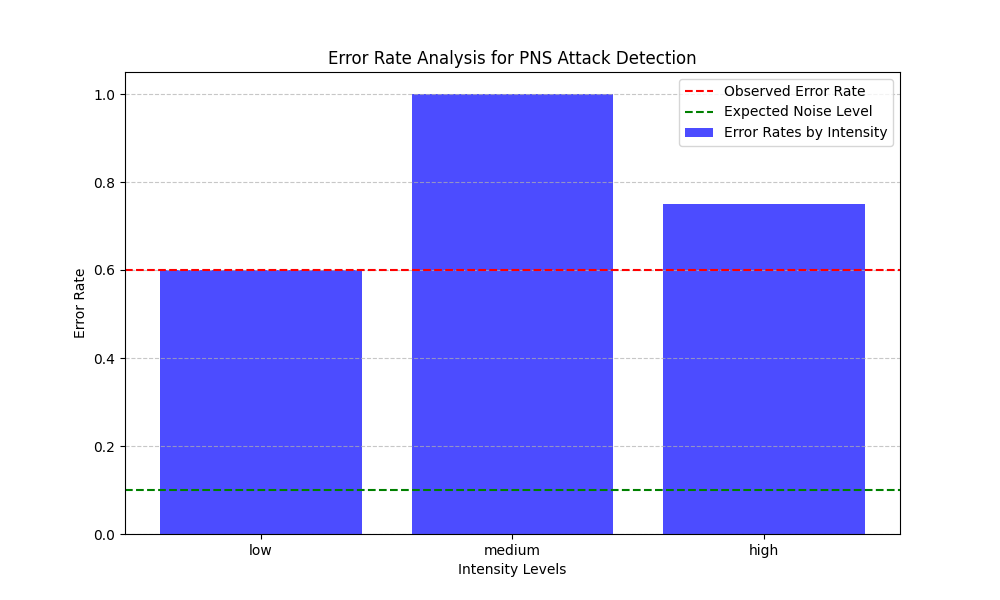
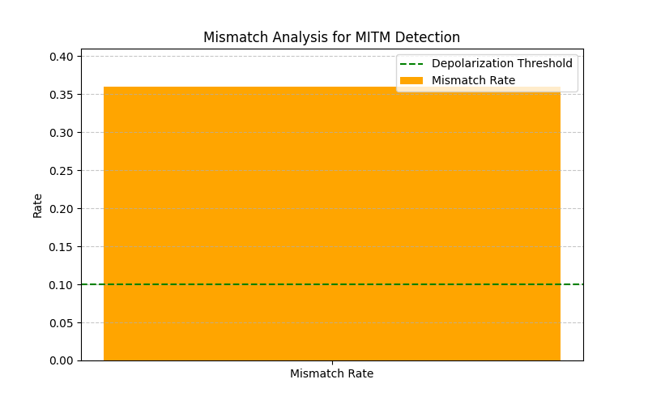

# Quantum Attack Simulator

A Python-based simulator for analyzing the security of quantum communication systems, specifically the BB84 protocol. This simulator includes features to simulate and analyze the effects of **depolarization noise**, **Man-in-the-Middle (MITM) attacks**, and **Photon Number Splitting (PNS) attacks**.

---

## Table of Contents
- [Introduction](#introduction)
- [BB84 Protocol Overview](#bb84-protocol-overview)
- [Depolarization Noise](#depolarization-noise)
- [Man-in-the-Middle (MITM) Attack](#man-in-the-middle-mitm-attack)
- [Photon Number Splitting (PNS) Attack](#photon-number-splitting-pns-attack)
- [How to Use the Simulator](#how-to-use-the-simulator)
- [Example Outputs and Visualizations](#example-outputs-and-visualizations)
- [License](#license)

---

## Introduction

The **Quantum Attack Simulator** allows users to study how various noise sources and attack vectors impact the security of the BB84 quantum key distribution protocol. By providing visualization tools and detailed analysis of attack effects, this simulator is an educational and research-oriented tool for understanding quantum communication vulnerabilities.

## BB84 Protocol Overview

The BB84 protocol is a quantum key distribution protocol that enables two parties (commonly referred to as "Sender" and "Receiver") to securely generate a shared cryptographic key. The protocol leverages the principles of quantum mechanics, such as:
- **Quantum Superposition**: Qubits can exist in multiple states simultaneously.
- **No-Cloning Theorem**: Quantum states cannot be perfectly duplicated.
- **Measurement Collapse**: Measuring a quantum state changes it, making eavesdropping detectable.

## Depolarization Noise

Depolarization noise refers to the random flipping of qubit states during transmission due to imperfections in the quantum channel. This noise:
- Simulates natural environmental disturbances.
- Can be mistaken for eavesdropping unless carefully analyzed.

## Attack Scenarios

### Man-in-the-Middle (MITM) Attack

A MITM attack involves an adversary intercepting quantum communication between the Sender and Receiver:
- The attacker measures the qubits using a randomly chosen basis.
- After measurement, the attacker resends qubits to the Receiver, potentially introducing errors.

### Photon Number Splitting (PNS) Attack

In a PNS attack, an adversary exploits decoy states by:
- Splitting multi-photon signals.
- Measuring one photon while forwarding the rest to the Receiver.
- This reduces the attacker's detection probability but increases error rates at certain intensity levels.

## How to Use the Simulator

### Prerequisites
- **Python 3.7 or later**
- Install required dependencies:
```bash
pip install -r requirements.txt
```
### Installation
Clone this repository and install locally:
 ```bash
git clone https://github.com/yourusername/quantum-attack-simulator.git
cd quantum-attack-simulator
```
Alternatively, install the package directly via pip:
```bash
pip install quantum-attack-simulator
```
### Running the Simulator
To run the simulator with default settings:
```bash
python examples/bb84_example.py
```
You can customize the simulation with the following arguments:

- `--attack-type`: Specify the type of attack to simulate. Options are:
  - `None (Default)`: No attack is simulated.
  - `MITM`: Simulate a Man-in-the-Middle attack.
  - `PNS`: Simulate a Photon Number Splitting attack.

- `--depolarization-noise`: Enable or disable depolarization noise.
  - `0 (Default)`: Disable depolarization noise.
  - `1`: Enable depolarization noise (with a probability of 0.1).

Examples:
```bash
python examples/bb84_example.py --attack-type MITM --depolarization-noise 1
```
```bash
python examples/bb84_example.py --attack-type PNS
```
```bash
python examples/bb84_example.py --depolarization-noise 1
```

## Example Outputs and Visualizations
### Example Output for PNS Attack
Example console output during a PNS attack simulation:
```bash
Receiver's Bases: ZXXZZXXZZZZXZXXZXXZXXZZZXXXZZZXXXXZZXZZZ
Receiver's Bits: 0011010101110111010100001101001110010010

Proceeding with PNS attack detection...
Error rates by intensity (for PNS Check): {'low': 0.6, 'medium': 1.0, 'high': 0.75}
Possible PNS attack detected. Final error rate: 0.6
Communication is terminated due to possible PNS attack.
```

### PNS Attack Visualization

#### Description of the Visualization
- **Blue Bars:** Error rates for different intensity levels (`low`, `medium`, `high`).
- **Red Dashed Line:** Observed error rate across all qubits during communication.
- **Green Dashed Line:** Expected noise level, representing the depolarization noise threshold.

This visualization helps distinguish between natural noise and potential attacks by comparing observed error rates against expected thresholds.



### Example Output for MITM Attack
Example console output during a MITM attack simulation:
```bash
Receiver's Bases: XXXZXZXZXZXXZXZZZXXZZXXZZXZZZZZZZZZXXZZZ
Receiver's Bits: 1000001111110010110000110111010111100100

Performing security checks...
An interception detected. Mismatched bits: 9
Mismatch detected! Analyzing possible causes...
Observed error rate: 36.00% (expected <= 10.00%)
Differences exceed depolarization noise levels and may indicate an attack.
Communication is terminated due to detected interception. Possible MITM attack.
```
### MITM Attack Visualization

#### Description of the Visualization
- **Orange Bar:** Mismatch rate between the Sender's and Receiver's shared bits.
- **Green Dashed Line:** Depolarization noise threshold, indicating the maximum expected error rate due to natural noise.

This visualization aids in identifying potential MITM attacks by comparing mismatch rates against the expected noise threshold.



## License

This project is licensed under the Apache License, Version 2.0.  
You may obtain a copy of the License at:  [http://www.apache.org/licenses/LICENSE-2.0](http://www.apache.org/licenses/LICENSE-2.0)

Unless required by applicable law or agreed to in writing, this software is distributed on an "AS IS" BASIS, WITHOUT WARRANTIES OR CONDITIONS OF ANY KIND, either express or implied. See the License for the specific language governing permissions and limitations under the License.
For more details, refer to the [LICENSE file in this repository](#).
